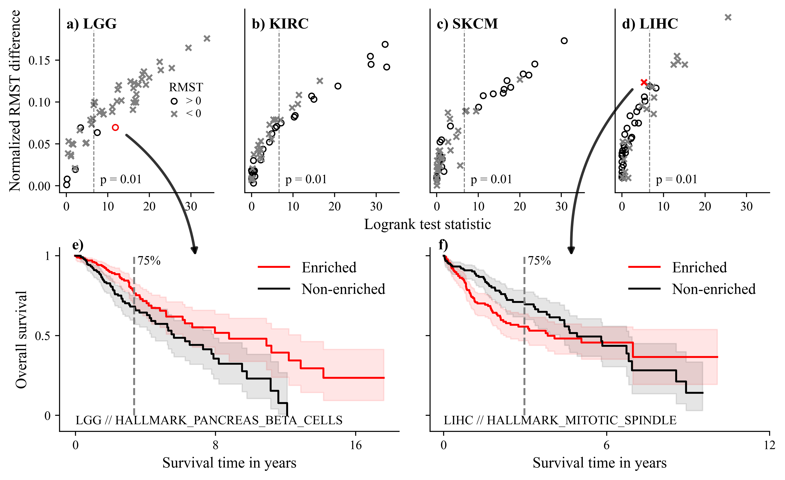
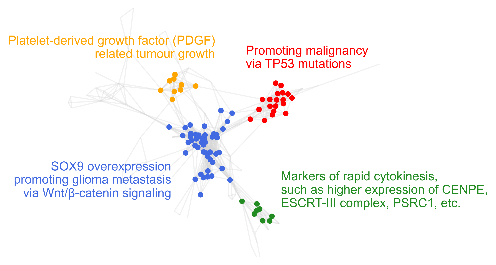

# Large Scale Gene Set Ranking for Survival-Related Gene Sets
[](https://zenodo.org/badge/latestdoi/706679936)

This is code to reproduce key results and figures from the article: **Large Scale Gene Set Ranking for Survival-Related Gene Sets**.



## Instalation

The code was tested on Ubuntu 20.04.4 LTS and MacOS 13.1. With python versions 3.9.15 and 3.10.8.

Follow these steps to prepare the environment:

- Clone the repository

```bash
git clone https://github.com/MartinSpendl/survival-geneset-ranking
cd survival-geneset-ranking
```

- Install the required packages

```bash
# using pip in a virtual environment
pip install -r requirements.txt

# using Conda
conda create --name <env_name> --file requirements.txt
conda activate <env_name>
```

## Data

Data used for the analysis is publically accessible.

### TCGA RNAseq expressions

Download repository and run all 4 notebooks: ```https://github.com/JakaKokosar/tcga-data.git```

### Genesets

Download genesets from the MSigDB by signing in.
Save them to the `data/genesets` directory.

We used:
- Hallmark genesets: `h.all.v2023.1.Hs.symbols.gmt`
- GO-Biological Process: `c5.go.bp.v2023.1.Hs.symbols.gmt`

## Reproduce results

Firstly, run both scipts in the **/scipts** directory:

```bash
python calculate_ssGSEA.py

python calculate_statistical_test.py
```

Secondly, run notebooks in the **/notebooks** directory.

*Figures from the notebooks are stored in the /figures directory.*

## Highlights

Cluters of survival-related genesets from GO gene sets on the TCGA-KIRC dataset.


